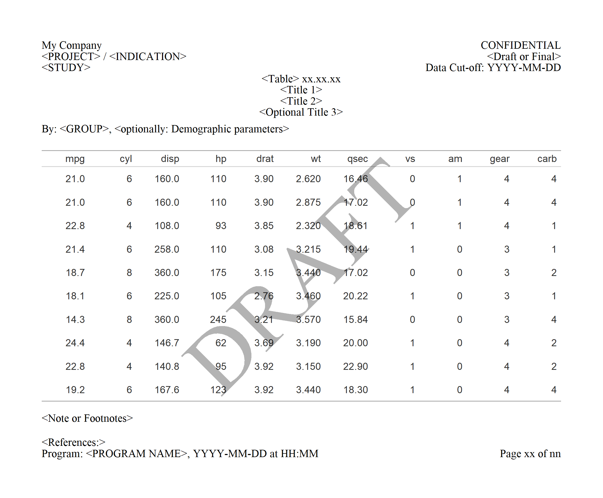

# gridify 

[](https://github.com/pharmaverse/gridify/actions/workflows/R-CMD-check.yaml)
[](https://app.codecov.io/gh/pharmaverse/gridify)
[](https://pharmaverse.org)
[](https://CRAN.R-project.org/package=gridify)

## Overview

In the pharmaceutical industry, and many other fields that rely heavily
on data reporting, there is often a need to create figures and tables
with specific graphical arrangements. These could be titles, subtitles,
captions, footnotes, and other text elements that provide important
context to the data being shown.

However, creating the headers and footers etc. and correctly positioning
them around the output can be challenging, often requiring fine-tuning.
This can be time-consuming and can lead to inconsistencies in the way the
figures and tables are presented across different projects.

`gridify` builds on the base R `grid` package and makes it easy to add
flexible and customizable information around a figure or table using a
pre-defined or custom layout. The `gridify` package works with all of
the following input types, creating consistency when using various
different inputs:

**grob**, **gtable**, **ggplot**, **flextable**, **gt**,
**base R plots (by formula)**  
Whilst **rtables** are not directly supported, we can use **rtables** with `gridify` by first converting them to **flextable**.

As `gridify` is based on the graphical tool **grid**, any figure or table
inputs are converted to a `grob` object in `gridify` and the result of using
`gridify` is always a graphical image.

## Installation

You can install the newest release version from CRAN:

```r
install.packages("gridify")
```

Or you can install the newest development version from Pharmaverse GitHub (example):

```r
# install.packages("remotes")
remotes::install_github("pharmaverse/gridify", build_manual = TRUE)
```

## Example

The workflow of the package is as follows:

1.  Create your object (`ggplot`, `gt` etc.)
2.  Choose a layout (predefined or custom). Use `get_layouts()` to see the predefined options
3.  Use `gridify()` to create a `gridify` object
4.  Print the `gridify` object to see empty cells
5.  Use `set_cell()` to fill in the various text elements in the layout
    (headers, footers etc.)

The following example uses a table created by the `gt` package and the
`gridify` layout `pharma_layout_base()`.

```r
library(gridify)
# install.packages("gt")
# gt needs gtable
# install.packages("gtable")
library(gt)
# (to use |> version 4.1.0 of R is required, for lower versions we recommend %>% from magrittr)

tab <- gt::gt(head(mtcars, n = 10))  |>
  gt::tab_options(
    table.width = gt::pct(100),
    data_row.padding = gt::px(10),
    table_body.hlines.color = "white",
    table.font.size = 12
  )

# Use `gridify()` to create a `gridify` object
gridify_object <- gridify(
  object = tab,
  # Choose a layout (predefined or custom)
  layout = pharma_layout_base(
    margin = grid::unit(c(0.5, 0.5, 0.5, 0.5), "inches"),
    global_gpar = grid::gpar(fontfamily = "serif", fontsize = 10)
  )
)
# Print the `gridify` object to see empty cells
gridify_object
# Use `set_cell()` to fill in the various text elements in the layout (headers etc.)
gridify_object_fill <- gridify_object |>
  set_cell("header_left_1", "My Company") |>
  set_cell("header_left_2", "<PROJECT> / <INDICATION>") |>
  set_cell("header_left_3", "<STUDY>") |>
  set_cell("header_right_1", "CONFIDENTIAL") |>
  set_cell("header_right_2", "<Draft or Final>") |>
  set_cell("header_right_3", "Data Cut-off: YYYY-MM-DD") |>
  set_cell("output_num", "<Table> xx.xx.xx") |>
  set_cell("title_1", "<Title 1>") |>
  set_cell("title_2", "<Title 2>") |>
  set_cell("title_3", "<Optional Title 3>") |>
  set_cell("by_line", "By: <GROUP>, <optionally: Demographic parameters>") |>
  set_cell("note", "<Note or Footnotes>") |>
  set_cell("references", "<References:>") |>
  set_cell("footer_left", "Program: <PROGRAM NAME>, YYYY-MM-DD at HH:MM") |>
  set_cell("footer_right", "Page xx of nn") |>
  set_cell("watermark", "DRAFT")

gridify_object_fill

print(gridify_object_fill)
```



Note: Get the image using  
`export_to(gridify_object_fill, to = "mypng.png", res = 300, width = 2300, height = 1900)`

## Documentation Guide

For more information please visit the following vignettes:

- **Getting Started**
  `vignette("gridify", package = "gridify")` - A case study in
  how the above example is constructed.
- **Simple Examples**
  `vignette("simple_examples", package = "gridify")` - A showcase of
  implementations of `gridify` for the various possible inputs.
- **Multi-Page Examples**
  `vignette("multi_page_examples", package = "gridify")` - Showing how to
  use `gridify` in more complex situations e.g a for-loop for multiple results.
- **Create Custom Layout**
  `vignette("create_custom_layout", package = "gridify")` - An
  explanation on how to create a custom layout to use in `gridify`.
- **Transparency of gridify**
  `vignette("transparency", package = "gridify")` - How to extract the
  raw grid code to reproduce a `gridify` object.

## Related packages

Other packages exist which add headers, footers, and other elements to figures and tables; most of the input classes to `gridify` already support these features. 
However, `gridify` was created not to supersede these,
but to be used in conjunction with, in a way that is flexible for all use
cases and consistent across various inputs.

## Contributing

Interested in contributing? Check out the contributing guidelines, `CONTRIBUTING.md`. 
Please note that this project is released with a Code of Conduct, `CODE_OF_CONDUCT.md`. 
By contributing to this project, you agree to abide by its terms.

## Acknowledgments

Along with the authors and contributors, thanks to the following people for their support:

Alberto Montironi, Jonathan Bleier, Cynthia McShea, Nils Penard, Oswald Dallimore, Laetitia Lemoine, Daniel Vicencio Perez, Richard Abdy
