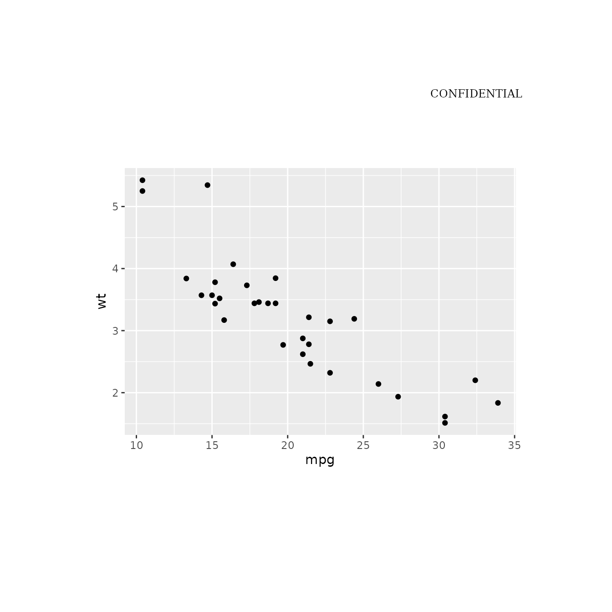
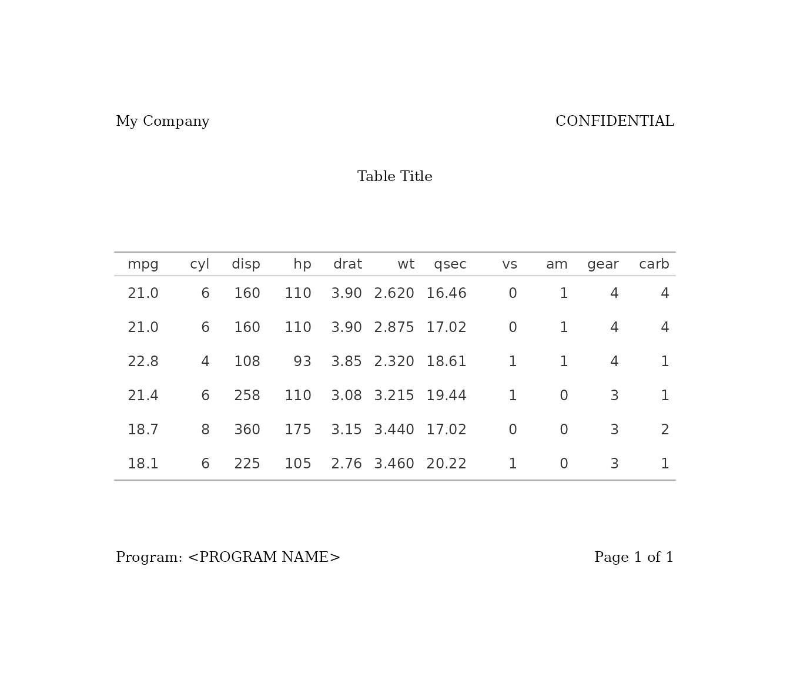

# Get Started with gridify

## Introduction

In the pharmaceutical industry, and many other fields that rely heavily
on data reporting, there is often a need to create tables and figures
with specific text elements — like titles, subtitles, captions, and
footnotes — positioned consistently around the output. Manually
arranging these elements can be time-consuming and prone to
inconsistencies across projects.

`gridify` addresses this by building on the base R
[grid](https://cran.r-project.org/package=grid) package, making it easy
to add flexible, customizable elements around a plot or table. This
ensures a consistent layout for text elements (like headers, footers,
etc.) across various output types, such as:

- `ggplot2` objects  

- `flextable` tables

- `gt` tables

- Base R figures  

- Any **grid**-convertible object (e.g., **grob**, **gtable**)

Because `gridify` is based on a graphical system, even tables become
graphical objects (grobs) under the hood, meaning the end result is
always an image.

## Installation

You can install the newest release version from CRAN:

``` r
install.packages("gridify")
```

Or you can install the newest development version from Pharmaverse
GitHub (example):

``` r
# install.packages("remotes")
remotes::install_github("pharmaverse/gridify", build_manual = TRUE)
```

Then load **gridify**:

``` r
library(gridify)
library(magrittr)
```

## Basic Workflow

1.  **Create your object** (figure or table).  
2.  **Choose a layout** (built-in or custom).  
3.  **Wrap the object** in
    [`gridify()`](https://pharmaverse.github.io/gridify/reference/gridify.md).  
4.  **Fill text cells** using
    [`set_cell()`](https://pharmaverse.github.io/gridify/reference/set_cell.md)
    for headers, footers, notes, etc.

Below is a minimal example using `ggplot2` for demonstration. The same
approach works for `gt`, `flextable`, or base R figures.  
For `rtables`, convert them into a `flextable` using
[`rtables.officer::tt_to_flextable()`](https://insightsengineering.github.io/rtables.officer/latest-release/reference/tt_to_flextable.html)
before following this approach.

### 1. Create a Figure

``` r
library(ggplot2)

basic_plot <- ggplot2::ggplot(mtcars, ggplot2::aes(x = mpg, y = wt)) +
  ggplot2::geom_point()
```

*(For tables, simply replace `basic_plot` with your `gt` or `flextable`
object.)*

### 2. Pick a Layout

In the `gridify` package, a **layout** is a predefined structure that
determines how various elements of an output are arranged. It defines
the positions of different components such as the output, title,
subtitle, footnotes, etc., on the available area.

Layouts in `gridify` define where to place titles, footers, subtitles,
etc., so your figures (or tables, or any grobs) have consistent text
elements.

You can use built-in layouts or create your own (see
[`vignette("create_custom_layout", package = "gridify")`](https://pharmaverse.github.io/gridify/articles/create_custom_layout.md)).

The built-in layouts include:

| Function                                                                                            | Description                                                                                                                                                    |
|-----------------------------------------------------------------------------------------------------|----------------------------------------------------------------------------------------------------------------------------------------------------------------|
| [`simple_layout()`](https://pharmaverse.github.io/gridify/reference/simple_layout.md)               | A layout with two cells: `title` (top) and `footer` (bottom).                                                                                                  |
| [`complex_layout()`](https://pharmaverse.github.io/gridify/reference/complex_layout.md)             | A multi-cell layout including `header_left`, `header_middle`, `header_right`, `title`, `subtitle`, `note`, `footer_left`, `footer_middle`, and `footer_right`. |
| [`pharma_layout_base()`](https://pharmaverse.github.io/gridify/reference/pharma_layout_base.md)     | A base layout for pharmaceutical outputs, with predefined cells for headers, footers, titles, subtitles, notes, and references (defaults can be overwritten).  |
| [`pharma_layout_letter()`](https://pharmaverse.github.io/gridify/reference/pharma_layout_letter.md) | A layout for pharmaceutical letters, with predefined cells for headers, footers, titles, subtitles, notes, and references (defaults can be overwritten).       |
| [`pharma_layout_A4()`](https://pharmaverse.github.io/gridify/reference/pharma_layout_A4.md)         | Similar to [`pharma_layout_letter()`](https://pharmaverse.github.io/gridify/reference/pharma_layout_letter.md), but for A4 size.                               |

``` r
pharma_layout_letter()
#> gridifyLayout object
#> ---------------------
#> Layout dimensions:
#>   Number of rows: 14
#>   Number of columns: 3
#> 
#> Heights of rows:
#>   Row 1: 1 lines
#>   Row 2: 1 lines
#>   Row 3: 1 lines
#>   Row 4: 1 lines
#>   Row 5: 1 lines
#>   Row 6: 1 lines
#>   Row 7: 0 lines
#>   Row 8: 0 lines
#>   Row 9: 1 lines
#>   Row 10: 1 null
#>   Row 11: 1 lines
#>   Row 12: 1 lines
#>   Row 13: 0 lines
#>   Row 14: 1 lines
#> 
#> Widths of columns:
#>   Column 1: 0.333333333333333 npc
#>   Column 2: 0.333333333333333 npc
#>   Column 3: 0.333333333333333 npc
#> 
#> Object Position:
#>   Row: 10
#>   Col: 1-3
#>   Width: 1
#>   Height: 1
#> 
#> Object Row Heights:
#>   Row 10: 1 null
#> 
#> Margin:
#>   Top: 1 inches
#>   Right: 1 inches
#>   Bottom: 1.23 inches
#>   Left: 1 inches
#> 
#> Global graphical parameters:
#>   fill: transparent
#>   col: black
#>   lty: solid
#>   lwd: 1
#>   cex: 1
#>   fontsize: 9
#>   lineheight: 0.95
#>   font: 1
#>   fontfamily: serif
#>   alpha: 1
#>   lineend: round
#>   linejoin: round
#>   linemitre: 10
#>   lex: 1 
#> 
#> Background colour:
#>   transparent
#> 
#> Default Cell Info:
#>   header_left_1:
#>     row:1, col:1, text:NULL, mch:Inf, x:0, y:0.5, hjust:0, vjust:0.5, rot:0, 
#>   header_left_2:
#>     row:2, col:1, text:NULL, mch:Inf, x:0, y:0.5, hjust:0, vjust:0.5, rot:0, 
#>   header_left_3:
#>     row:3, col:1, text:NULL, mch:Inf, x:0, y:0.5, hjust:0, vjust:0.5, rot:0, 
#>   header_right_1:
#>     row:1, col:3, text:CONFIDENTI..., mch:Inf, x:1, y:0.5, hjust:1, vjust:0.5, rot:0, 
#>   header_right_2:
#>     row:2, col:3, text:NULL, mch:Inf, x:1, y:0.5, hjust:1, vjust:0.5, rot:0, 
#>   header_right_3:
#>     row:3, col:3, text:NULL, mch:Inf, x:1, y:0.5, hjust:1, vjust:0.5, rot:0, 
#>   output_num:
#>     row:4, col:2, text:NULL, mch:Inf, x:0.5, y:0.5, hjust:0.5, vjust:0.5, rot:0, 
#>   title_1:
#>     row:5, col:2, text:NULL, mch:Inf, x:0.5, y:0.5, hjust:0.5, vjust:0.5, rot:0, 
#>   title_2:
#>     row:6, col:2, text:NULL, mch:Inf, x:0.5, y:0.5, hjust:0.5, vjust:0.5, rot:0, 
#>   title_3:
#>     row:7, col:2, text:NULL, mch:Inf, x:0.5, y:0.5, hjust:0.5, vjust:0.5, rot:0, 
#>   by_line:
#>     row:8-9, col:1-3, text:NULL, mch:Inf, x:0, y:0.5, hjust:0, vjust:0.5, rot:0, 
#>   note:
#>     row:11, col:1-3, text:NULL, mch:100, x:0, y:0.5, hjust:0, vjust:0.5, rot:0, 
#>   references:
#>     row:13, col:1, text:NULL, mch:Inf, x:0, y:0.5, hjust:0, vjust:0.5, rot:0, 
#>   footer_left:
#>     row:14, col:1, text:NULL, mch:Inf, x:0, y:0.5, hjust:0, vjust:0.5, rot:0, 
#>   footer_right:
#>     row:14, col:3, text:NULL, mch:Inf, x:1, y:0.5, hjust:1, vjust:0.5, rot:0, 
#>   watermark:
#>     row:10, col:2, text:NULL, mch:Inf, x:0.5, y:0.5, hjust:0.5, vjust:0.5, rot:45, 
#>     gpar - fontsize:80, alpha:0.3,
```

### 3. Wrap with gridify

Use the
[`gridify()`](https://pharmaverse.github.io/gridify/reference/gridify.md)
function to combine your object (figure or table) with the specified
layout:

``` r
grob_object <- gridify(
  object = basic_plot,
  layout = pharma_layout_letter()
)
```

### 4. Add Text to Cells

Use the show method (return the object) to check out available cells.

``` r
grob_object
#> gridifyClass object
#> ---------------------
#> Please run `show_spec(object)` or print the layout to get more specs.
#> 
#> Cells:
#>   header_left_1: empty
#>   header_left_2: empty
#>   header_left_3: empty
#>   header_right_1: filled
#>   header_right_2: empty
#>   header_right_3: empty
#>   output_num: empty
#>   title_1: empty
#>   title_2: empty
#>   title_3: empty
#>   by_line: empty
#>   note: empty
#>   references: empty
#>   footer_left: empty
#>   footer_right: empty
#>   watermark: empty
```



You can add text to labeled cells (headers, footers, notes, etc.).

``` r
grob_object <- grob_object %>%
  set_cell("header_left_1", "My Company") %>%
  set_cell("header_left_2", "<PROJECT> / <INDICATION>") %>%
  set_cell("header_left_3", "<STUDY>") %>%
  set_cell("header_right_1", "CONFIDENTIAL") %>%
  set_cell("header_right_2", "<Draft or Final>") %>%
  set_cell("header_right_3", "Data Cut-off: YYYY-MM-DD") %>%
  set_cell("output_num", "<Figure> xx.xx.xx") %>%
  set_cell("title_1", "<Title 1>") %>%
  set_cell("title_2", "<Title 2>") %>%
  set_cell("title_3", "<Optional Title 3>") %>%
  set_cell("by_line", "By: <GROUP>, <optionally: Demographic parameters>") %>%
  set_cell("note", "<Note or Footnotes>") %>%
  set_cell("references", "<References:>") %>%
  set_cell("footer_left", "Program: <PROGRAM NAME>, YYYY-MM-DD at HH:MM") %>%
  set_cell("footer_right", "Page xx of nn") %>%
  set_cell("watermark", "DRAFT")

grob_object
#> gridifyClass object
#> ---------------------
#> Please run `show_spec(object)` or print the layout to get more specs.
#> 
#> Cells:
#>   header_left_1: filled
#>   header_left_2: filled
#>   header_left_3: filled
#>   header_right_1: filled
#>   header_right_2: filled
#>   header_right_3: filled
#>   output_num: filled
#>   title_1: filled
#>   title_2: filled
#>   title_3: filled
#>   by_line: filled
#>   note: filled
#>   references: filled
#>   footer_left: filled
#>   footer_right: filled
#>   watermark: filled
```


The output is automatically drawn for the user.

### 5. Print or Assign

Calling [`print()`](https://rdrr.io/r/base/print.html) on a `gridify`
object displays the final layout in your R session, and invisibly
returns the `grid` grob:

``` r
final_grob <- print(grob_object)
```


Raw `grid` code behind:

``` r
final_grob
#> grid::gTree(children = grid::gList(grid::rectGrob(x = 0, y = 0, 
#>     width = 1, height = 1, just = c("left", "bottom"), gp = grid::gpar(fill = "transparent", 
#>         col = "transparent")), grid::gTree(children = do.call(grid::gList, 
#>     list(grid::grobTree(grid::editGrob(OBJECT, vp = grid::viewport(height = grid::unit.pmax(grid::unit(1, 
#>         "npc"), grid::unit(1, "inch")), width = grid::unit.pmax(grid::unit(1, 
#>         "npc"), grid::unit(1, "inch")))), vp = grid::viewport(layout.pos.row = 10, 
#>         layout.pos.col = c(1, 3))), grid::grobTree(grid::textGrob(label = "My Company", 
#>         x = 0, y = 0.5, hjust = 0, vjust = 0.5, rot = 0, gp = grid::gpar(fontsize = 9)), 
#>         gp = grid::gpar(), vp = grid::viewport(layout.pos.row = 1, 
#>             layout.pos.col = 1)), grid::grobTree(grid::textGrob(label = "<PROJECT> / <INDICATION>", 
#>         x = 0, y = 0.5, hjust = 0, vjust = 0.5, rot = 0, gp = grid::gpar(fontsize = 9)), 
#>         gp = grid::gpar(), vp = grid::viewport(layout.pos.row = 2, 
#>             layout.pos.col = 1)), grid::grobTree(grid::textGrob(label = "<STUDY>", 
#>         x = 0, y = 0.5, hjust = 0, vjust = 0.5, rot = 0, gp = grid::gpar(fontsize = 9)), 
#>         gp = grid::gpar(), vp = grid::viewport(layout.pos.row = 3, 
#>             layout.pos.col = 1)), grid::grobTree(grid::textGrob(label = "CONFIDENTIAL", 
#>         x = 1, y = 0.5, hjust = 1, vjust = 0.5, rot = 0, gp = grid::gpar(fontsize = 9)), 
#>         gp = grid::gpar(), vp = grid::viewport(layout.pos.row = 1, 
#>             layout.pos.col = 3)), grid::grobTree(grid::textGrob(label = "<Draft or Final>", 
#>         x = 1, y = 0.5, hjust = 1, vjust = 0.5, rot = 0, gp = grid::gpar(fontsize = 9)), 
#>         gp = grid::gpar(), vp = grid::viewport(layout.pos.row = 2, 
#>             layout.pos.col = 3)), grid::grobTree(grid::textGrob(label = "Data Cut-off: YYYY-MM-DD", 
#>         x = 1, y = 0.5, hjust = 1, vjust = 0.5, rot = 0, gp = grid::gpar(fontsize = 9)), 
#>         gp = grid::gpar(), vp = grid::viewport(layout.pos.row = 3, 
#>             layout.pos.col = 3)), grid::grobTree(grid::textGrob(label = "<Figure> xx.xx.xx", 
#>         x = 0.5, y = 0.5, hjust = 0.5, vjust = 0.5, rot = 0, 
#>         gp = grid::gpar(fontsize = 9)), gp = grid::gpar(), vp = grid::viewport(layout.pos.row = 4, 
#>         layout.pos.col = 2)), grid::grobTree(grid::textGrob(label = "<Title 1>", 
#>         x = 0.5, y = 0.5, hjust = 0.5, vjust = 0.5, rot = 0, 
#>         gp = grid::gpar(fontsize = 9)), gp = grid::gpar(), vp = grid::viewport(layout.pos.row = 5, 
#>         layout.pos.col = 2)), grid::grobTree(grid::textGrob(label = "<Title 2>", 
#>         x = 0.5, y = 0.5, hjust = 0.5, vjust = 0.5, rot = 0, 
#>         gp = grid::gpar(fontsize = 9)), gp = grid::gpar(), vp = grid::viewport(layout.pos.row = 6, 
#>         layout.pos.col = 2)), grid::grobTree(grid::textGrob(label = "<Optional Title 3>", 
#>         x = 0.5, y = 0.5, hjust = 0.5, vjust = 0.5, rot = 0, 
#>         gp = grid::gpar(fontsize = 9)), gp = grid::gpar(), vp = grid::viewport(layout.pos.row = 7, 
#>         layout.pos.col = 2)), grid::grobTree(grid::textGrob(label = "By: <GROUP>, <optionally: Demographic parameters>", 
#>         x = 0, y = 0.5, hjust = 0, vjust = 0.5, rot = 0, gp = grid::gpar(fontsize = 9)), 
#>         gp = grid::gpar(), vp = grid::viewport(layout.pos.row = 8:9, 
#>             layout.pos.col = c(1, 3))), grid::grobTree(grid::textGrob(label = "<Note or Footnotes>", 
#>         x = 0, y = 0.5, hjust = 0, vjust = 0.5, rot = 0, gp = grid::gpar(fontsize = 9)), 
#>         gp = grid::gpar(), vp = grid::viewport(layout.pos.row = 11, 
#>             layout.pos.col = c(1, 3))), grid::grobTree(grid::textGrob(label = "<References:>", 
#>         x = 0, y = 0.5, hjust = 0, vjust = 0.5, rot = 0, gp = grid::gpar(fontsize = 9)), 
#>         gp = grid::gpar(), vp = grid::viewport(layout.pos.row = 13, 
#>             layout.pos.col = 1)), grid::grobTree(grid::textGrob(label = "Program: <PROGRAM NAME>, YYYY-MM-DD at HH:MM", 
#>         x = 0, y = 0.5, hjust = 0, vjust = 0.5, rot = 0, gp = grid::gpar(fontsize = 9)), 
#>         gp = grid::gpar(), vp = grid::viewport(layout.pos.row = 14, 
#>             layout.pos.col = 1)), grid::grobTree(grid::textGrob(label = "Page xx of nn", 
#>         x = 1, y = 0.5, hjust = 1, vjust = 0.5, rot = 0, gp = grid::gpar(fontsize = 9)), 
#>         gp = grid::gpar(), vp = grid::viewport(layout.pos.row = 14, 
#>             layout.pos.col = 3)), grid::grobTree(grid::textGrob(label = "DRAFT", 
#>         x = 0.5, y = 0.5, hjust = 0.5, vjust = 0.5, rot = 45, 
#>         gp = grid::gpar(fontsize = 80)), gp = grid::gpar(fontsize = 80, 
#>         alpha = 0.3), vp = grid::viewport(layout.pos.row = 10, 
#>         layout.pos.col = 2)))), vp = grid::viewport(name = "lyt", 
#>     x = grid::unit(1, "inches"), y = grid::unit(1.23, "inches"), 
#>     just = c("left", "bottom"), width = grid::unit(1, "npc") - 
#>         grid::unit(1, "inches") - grid::unit(1, "inches"), height = grid::unit(1, 
#>         "npc") - grid::unit(1, "inches") - grid::unit(1.23, "inches"), 
#>     gp = grid::gpar(fill = "transparent", col = "black", lty = "solid", 
#>         lwd = 1, cex = 1, fontsize = 9, lineheight = 0.95, fontfamily = "serif", 
#>         alpha = 1, lineend = "round", linejoin = "round", linemitre = 10, 
#>         lex = 1, fontface = 1L), layout = grid::grid.layout(nrow = 14L, 
#>         ncol = 3L, heights = grid::unit(c(0.34, 0.34, 0.34, 0.34, 
#>         0.34, 0.34, 0.34, 0.34, 0.34, 1, 0.34, 1, 0.34, 0.34), 
#>             c("cm", "cm", "cm", "cm", "cm", "cm", "cm", "cm", 
#>             "cm", "null", "cm", "lines", "cm", "cm")), widths = grid::unit(c(0.33, 
#>         0.33, 0.33), c("npc", "npc", "npc")))))))
#> attr(,"env")
#> <environment: 0x55f694f74ef8>
```

`gridify` uses meta-programming to capture all `grid` calls needed to
assemble your layout. That means you can retrieve or audit exactly how
the figure or table is constructed. This functionality is particularly
valuable in regulated environments (e.g., pharmaceuticals) or whenever
transparency and consistency are critical.

## Example with a Table

Below is a quick example from the README, using a `gt` table:

``` r
library(gt)

tab <- gt::gt(head(mtcars)) %>%
  gt::tab_options(
    table.width = gt::pct(100),
    data_row.padding = gt::px(10),
    table_body.hlines.color = "white",
    table.font.size = 12
  )

gridify(
  object = tab,
  layout = pharma_layout_base()
) %>%
  set_cell("header_left_1", "My Company") %>%
  set_cell("header_right_1", "CONFIDENTIAL") %>%
  set_cell("title_1", "Table Title") %>%
  set_cell("footer_left", "Program: <PROGRAM NAME>") %>%
  set_cell("footer_right", "Page 1 of 1")
#> gridifyClass object
#> ---------------------
#> Please run `show_spec(object)` or print the layout to get more specs.
#> 
#> Cells:
#>   header_left_1: filled
#>   header_left_2: empty
#>   header_left_3: empty
#>   header_right_1: filled
#>   header_right_2: empty
#>   header_right_3: empty
#>   output_num: empty
#>   title_1: filled
#>   title_2: empty
#>   title_3: empty
#>   by_line: empty
#>   note: empty
#>   references: empty
#>   footer_left: filled
#>   footer_right: filled
#>   watermark: empty
```



This wraps the `gt` table in a pharma-style layout, placing headers and
footers around it.

## Saving Your Output

To save `gridify` drawings to files see
[`vignette("simple_examples", package = "gridify")`](https://pharmaverse.github.io/gridify/articles/simple_examples.md).

## More Resources

- **Simple Examples**:
  [`vignette("simple_examples", package = "gridify")`](https://pharmaverse.github.io/gridify/articles/simple_examples.md)  
- **Complex Examples**:
  [`vignette("multi_page_examples", package = "gridify")`](https://pharmaverse.github.io/gridify/articles/multi_page_examples.md)  
- **Custom Layout**:
  [`vignette("create_custom_layout", package = "gridify")`](https://pharmaverse.github.io/gridify/articles/create_custom_layout.md)  
- **Transparency**:
  [`vignette("transparency", package = "gridify")`](https://pharmaverse.github.io/gridify/articles/transparency.md)

## Conclusion

That’s it! `gridify` enables you to consistently position text elements
around any figures or tables, all while letting you leverage base R
`grid` for maximum control and transparency. By defining or customizing
a layout once, you can reuse it across multiple outputs—saving time and
ensuring consistency.
