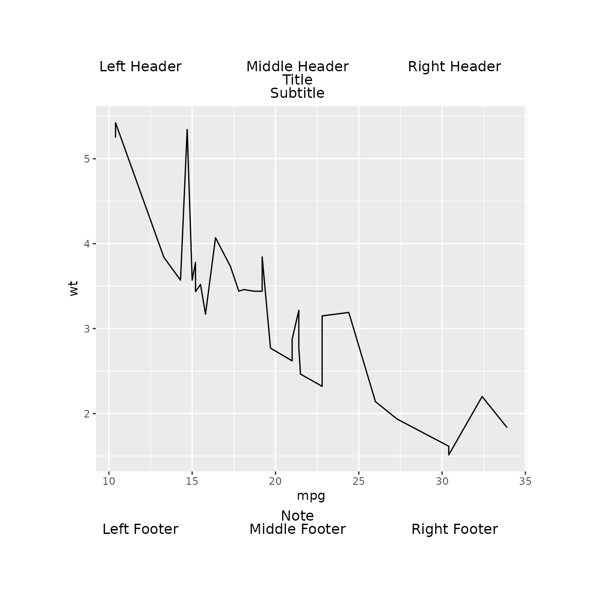

# Transparency with gridify

## Introduction

It is assumed that you have already read the other vignettes and
understand `gridify`.

The `gridify` package simplifies the creation of complex
[grid](https://cran.r-project.org/package=grid)-based layouts in R. It
builds on the base R `grid` package, providing a more intuitive
interface for constructing advanced graphical arrangements—such as
titles, headers, and footers—without requiring deep knowledge of `grid`
itself. A good [introduction to `grid` is available
here](https://bookdown.org/rdpeng/RProgDA/the-grid-package.html).

A key strength of `gridify` is its *meta-programming* approach: when you
print and assign a `gridify` object, you can retrieve and inspect the
exact `grid` call code. This helps ensure **transparency** so you can
see precisely how your outputs are composed. Such a feature is
invaluable in regulated industries and any environment where you need to
demonstrate how each output is generated.

## Example Usage

Below is a simple example showcasing how `gridify` wraps a `ggplot2`
figure with headers, footers, and additional text elements, all while
exposing the raw `grid` code used behind the scenes:

``` r
library(gridify)
# For the native pipe (|>), R 4.1.0 or higher is recommended.
# Otherwise, you can use magrittr's %>%.
library(magrittr)

library(ggplot2)

# Create and print a gridify object
grid_call_behind <- gridify(
  object = ggplot2::ggplot(
    data = mtcars,
    ggplot2::aes(x = mpg, y = wt)
  ) +
    ggplot2::geom_line(),
  layout = complex_layout(scales = "fixed")
) %>%
  set_cell("header_left", "Left Header") %>%
  set_cell("header_middle", "Middle Header") %>%
  set_cell("header_right", "Right Header") %>%
  set_cell("title", "Title") %>%
  set_cell("subtitle", "Subtitle") %>%
  set_cell("note", "Note") %>%
  set_cell("footer_left", "Left Footer") %>%
  set_cell("footer_middle", "Middle Footer") %>%
  set_cell("footer_right", "Right Footer") %>%
  print()
```


``` r

# The underlying grid call is returned invisibly by the print() method.
# We can inspect or store it for further manipulations:
grid_call_behind
#> grid::gTree(children = grid::gList(grid::rectGrob(x = 0, y = 0, 
#>     width = 1, height = 1, just = c("left", "bottom"), gp = grid::gpar(fill = "transparent", 
#>         col = "transparent")), grid::gTree(children = do.call(grid::gList, 
#>     list(grid::grobTree(grid::editGrob(OBJECT, vp = grid::viewport(height = grid::unit.pmax(grid::unit(1, 
#>         "npc"), grid::unit(1, "inch")), width = grid::unit.pmax(grid::unit(1, 
#>         "npc"), grid::unit(1, "inch")))), vp = grid::viewport(layout.pos.row = 4, 
#>         layout.pos.col = c(1, 3))), grid::grobTree(grid::textGrob(label = "Left Header", 
#>         x = 0.5, y = 0.5, hjust = 0.5, vjust = 0.5, rot = 0, 
#>         gp = grid::gpar()), gp = grid::gpar(), vp = grid::viewport(layout.pos.row = 1, 
#>         layout.pos.col = 1)), grid::grobTree(grid::textGrob(label = "Middle Header", 
#>         x = 0.5, y = 0.5, hjust = 0.5, vjust = 0.5, rot = 0, 
#>         gp = grid::gpar()), gp = grid::gpar(), vp = grid::viewport(layout.pos.row = 1, 
#>         layout.pos.col = 2)), grid::grobTree(grid::textGrob(label = "Right Header", 
#>         x = 0.5, y = 0.5, hjust = 0.5, vjust = 0.5, rot = 0, 
#>         gp = grid::gpar()), gp = grid::gpar(), vp = grid::viewport(layout.pos.row = 1, 
#>         layout.pos.col = 3)), grid::grobTree(grid::textGrob(label = "Title", 
#>         x = 0.5, y = 0.5, hjust = 0.5, vjust = 0.5, rot = 0, 
#>         gp = grid::gpar()), gp = grid::gpar(), vp = grid::viewport(layout.pos.row = 2, 
#>         layout.pos.col = c(1, 3))), grid::grobTree(grid::textGrob(label = "Subtitle", 
#>         x = 0.5, y = 0.5, hjust = 0.5, vjust = 0.5, rot = 0, 
#>         gp = grid::gpar()), gp = grid::gpar(), vp = grid::viewport(layout.pos.row = 3, 
#>         layout.pos.col = c(1, 3))), grid::grobTree(grid::textGrob(label = "Note", 
#>         x = 0.5, y = 0.5, hjust = 0.5, vjust = 0.5, rot = 0, 
#>         gp = grid::gpar()), gp = grid::gpar(), vp = grid::viewport(layout.pos.row = 5, 
#>         layout.pos.col = c(1, 3))), grid::grobTree(grid::textGrob(label = "Left Footer", 
#>         x = 0.5, y = 0.5, hjust = 0.5, vjust = 0.5, rot = 0, 
#>         gp = grid::gpar()), gp = grid::gpar(), vp = grid::viewport(layout.pos.row = 6, 
#>         layout.pos.col = 1)), grid::grobTree(grid::textGrob(label = "Middle Footer", 
#>         x = 0.5, y = 0.5, hjust = 0.5, vjust = 0.5, rot = 0, 
#>         gp = grid::gpar()), gp = grid::gpar(), vp = grid::viewport(layout.pos.row = 6, 
#>         layout.pos.col = 2)), grid::grobTree(grid::textGrob(label = "Right Footer", 
#>         x = 0.5, y = 0.5, hjust = 0.5, vjust = 0.5, rot = 0, 
#>         gp = grid::gpar()), gp = grid::gpar(), vp = grid::viewport(layout.pos.row = 6, 
#>         layout.pos.col = 3)))), vp = grid::viewport(name = "lyt", 
#>     x = grid::unit(0.1, "npc"), y = grid::unit(0.1, "npc"), just = c("left", 
#>         "bottom"), width = grid::unit(1, "npc") - grid::unit(0.1, 
#>         "npc") - grid::unit(0.1, "npc"), height = grid::unit(1, 
#>         "npc") - grid::unit(0.1, "npc") - grid::unit(0.1, "npc"), 
#>     gp = grid::gpar(), layout = grid::grid.layout(nrow = 6L, 
#>         ncol = 3L, heights = grid::unit(c(0.4, 0.4, 0.4, 1, 0.4, 
#>         0.4), c("cm", "cm", "cm", "null", "cm", "cm")), widths = grid::unit(c(0.33, 
#>         0.33, 0.33), c("npc", "npc", "npc")))))))
#> attr(,"env")
#> <environment: 0x56446a978e98>
```

``` r
# Retrieve the main object- either a figure or table
OBJECT <- attr(grid_call_behind, "env")[["OBJECT"]]
# Redraw the graphics by eval of the grid call
grid::grid.draw(eval(grid_call_behind))
```



Both of the graphics are the same.

When you call [`print()`](https://rdrr.io/r/base/print.html) on a
`gridify` object and assign it to a variable, `gridify` constructs and
returns the `grid` call. Through meta-programming, `gridify` captures
all `grid` calls required to produce your graphics.

## Key Transparency Benefits

1.  **Direct Visibility into the Layout**  
    By exposing the raw `grid` code, `gridify` ensures you can see
    exactly how your figures are constructed. This clear trail of code
    is especially helpful for validating complex graphics or meeting
    regulatory requirements.

2.  **Educational Insight**  
    If you’re interested in learning how `grid` works, you can study the
    generated code. It’s an excellent, hands-on way to build your
    knowledge of low-level graphics in R.

3.  **Audit and Debugging**  
    The ability to retrieve the full `grid` calls makes it
    straightforward to diagnose layout issues or confirm that all
    elements are placed correctly.

## Conclusion

By providing direct access to the underlying `grid` code, `gridify`
prioritizes **transparency**.

For more details on other aspects like reproducibility, consistency, and
advanced layouts, check out our package documentation and additional
vignettes.
